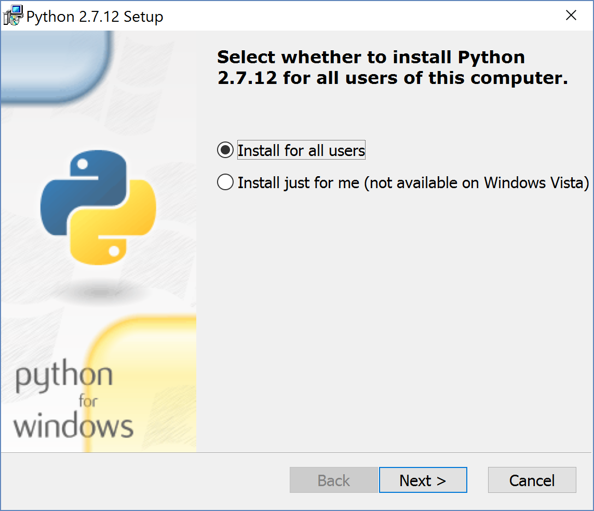
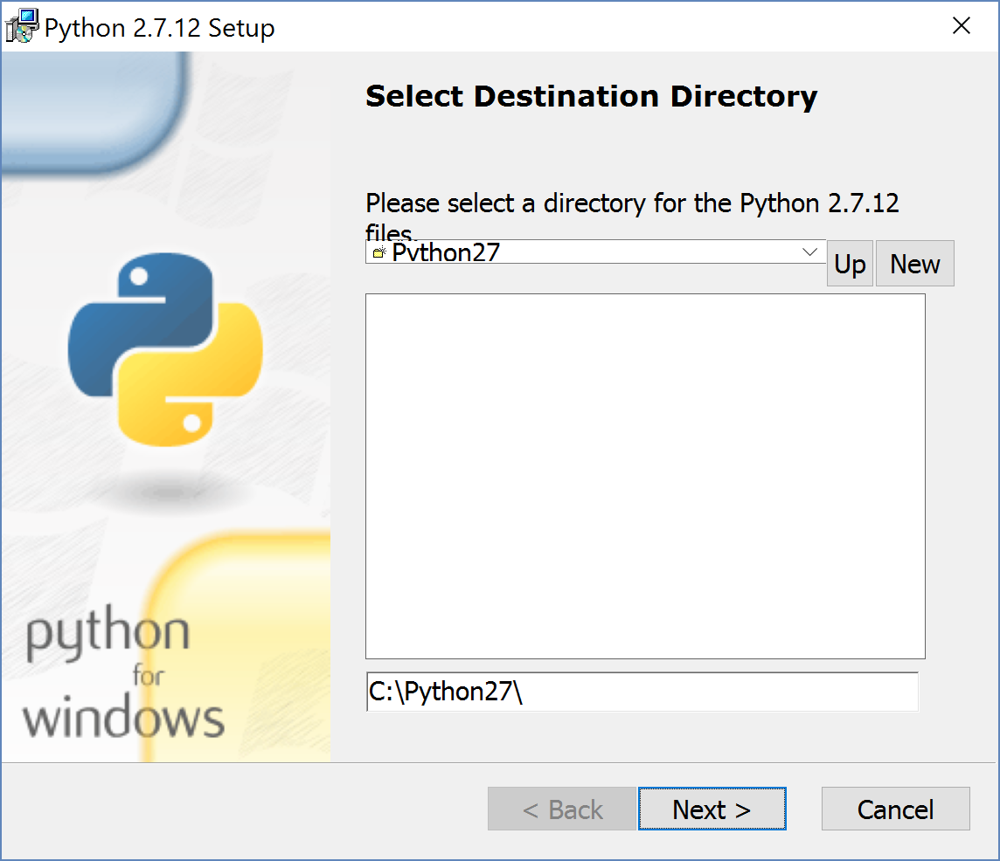
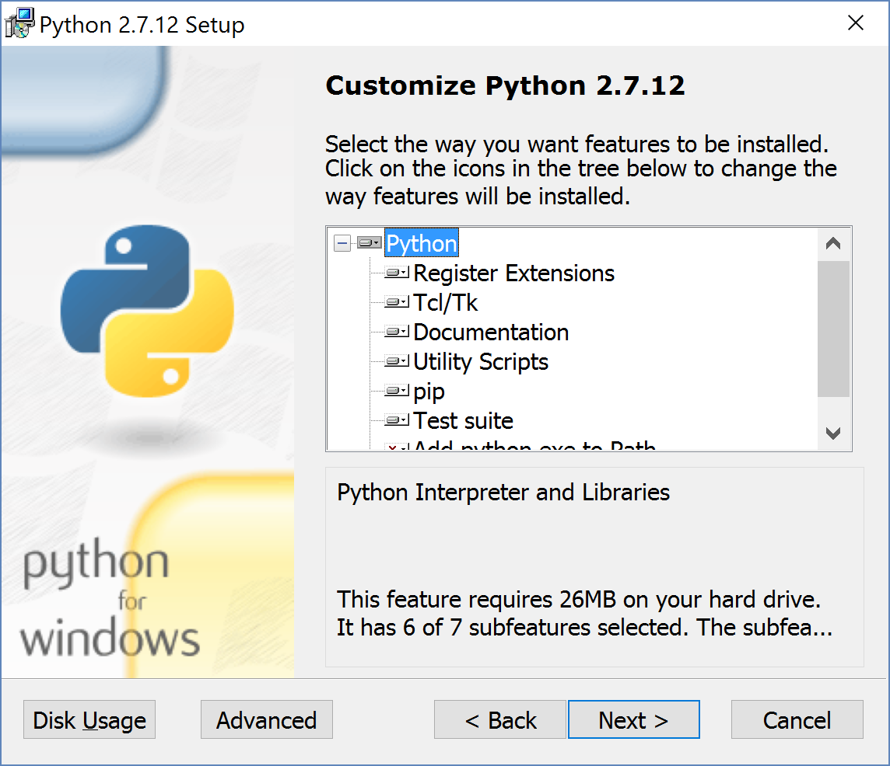
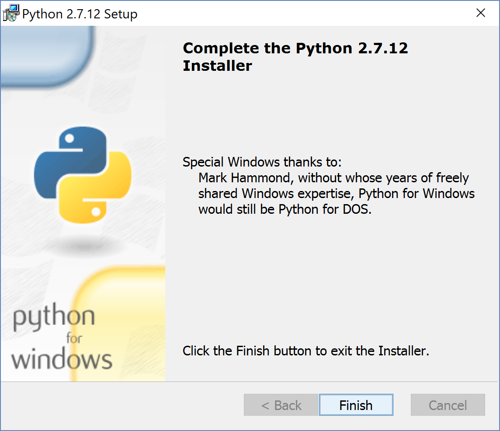
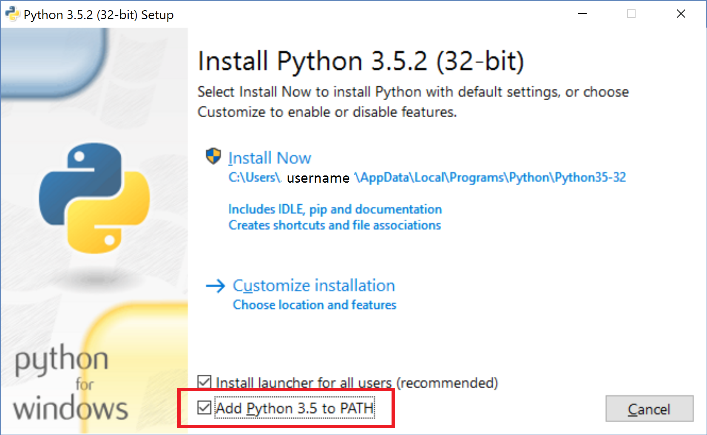
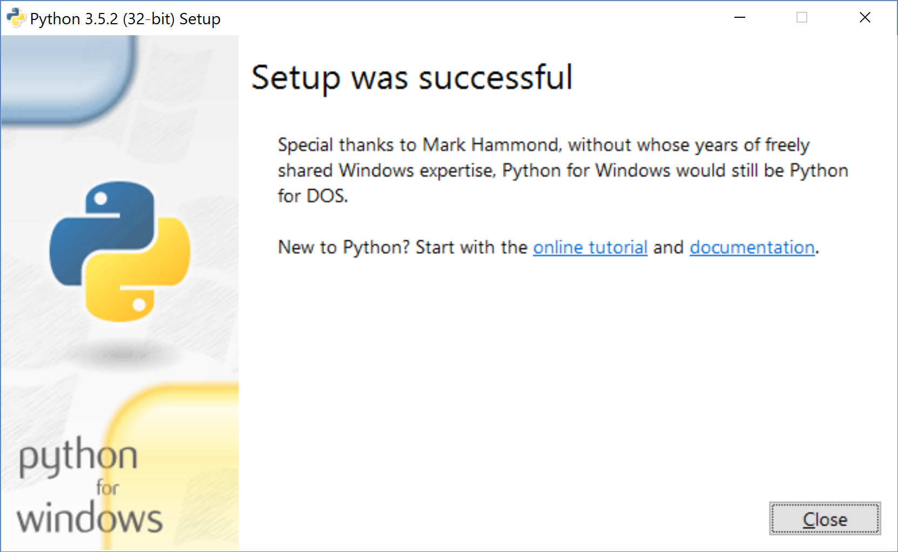

*******************
Python Installation
*******************

Python version 2 or 3?
======================

.. tip:: Recommendation: **Both**

* Develop your coding habbits in Python 3; it's not going away.
* Keep 2.7 around; you can't kill it, it's immortal. [#f1]_
* If your code's going public consider supporting both.

.. [#f1] Despite claims that `Python 2's scheduled End Of Life date (EOL, sunset date) is in 2020 <http://legacy.python.org/dev/peps/pep-0373/>`_.

.. seealso:: `Should I use Python 2 or Python 3 for my development activity? <https://wiki.python.org/moin/Python2orPython3>`_

Python 32 or 64-bit version?
============================

.. tip:: Recommendation: **32-bit**, unless ...

* You're willing to trade away memory for performance (64-bit can consume up twice the memory).
* You work with really large data sets and need access to more than 4GB of system memory.

Download Python
===============

32-Bit Python
-------------
* `Download Python 2.7.12 (32-bit) <https://www.python.org/ftp/python/2.7.12/python-2.7.12.msi>`_
* `Download Python 3.5.2 (32-bit) <https://www.python.org/ftp/python/3.5.2/python-3.5.2.exe>`_

64-Bit Python
-------------
* `Download Python 2.7.12 (64-bit) <https://www.python.org/ftp/python/2.7.12/python-2.7.12.amd64.msi>`_
* `Download Python 3.5.2 (64-bit) <https://www.python.org/ftp/python/3.5.2/python-3.5.2-amd64.exe>`_

.. seealso:: `Python downloads page <https://www.python.org/downloads>`_

Install Python
==============

Install Python 2.7
------------------
Double-click on the Python 2.7 MSI that you downloaded to launch the installer, and click the **"Next"** button at each screen to accept the default settings.

.. note:: At this point you may see a Windows pop-up dialog box, "Do you want to allow this application install software on your PC?" If the “Verified Publisher” is set to "Python Software Foundation" then click the “Yes” button.

.. seealso:: `User Account Control <https://technet.microsoft.com/en-us/itpro/windows/keep-secure/user-account-control-overview>`_

Click **"Finish"** to complete the Python 2.7 installation.

Install Python 3.5
------------------
Double-click on the Python 3.5 executable (.exe) that you downloaded to launch the installer.

.. note:: On the first screen make sure to check the **"Add Python 3.5 to PATH"** checkbox.

Click on the **“Install Now”** section to begin.

.. note:: At this point you may see a Windows pop-up dialog box, "Do you want to make change to your PC?" If the “Verified Publisher” is set to "Python Software Foundation" then click the “Yes” button.

Click **"Finish"**

Congratulations!
================
You have now installed both Python 2 & 3.